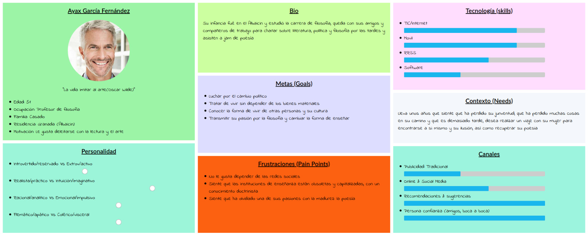
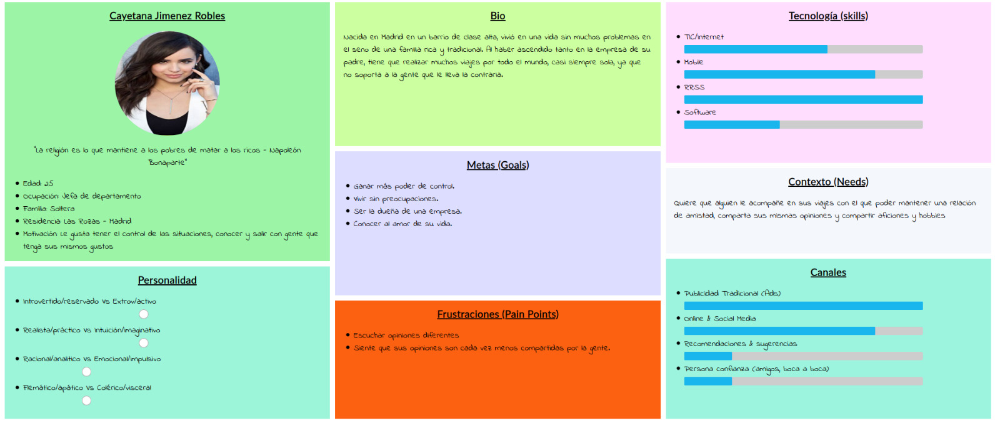
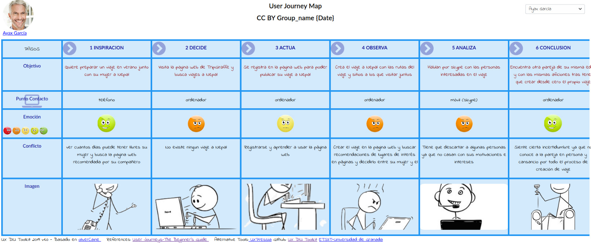
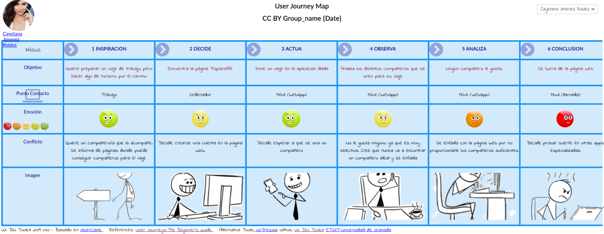

## DIU - Practica1, entregables

# Proceso de Diseño 

## Paso 1. UX Desk Research & Analisis 

 1.a Competitive Analysis
-----
En la práctica tenemos que analizar una plataforma en la que compartir viaje.Barajamos la opciones de Couchsurfing, Showaround y Tripgirafe. Couchsurfing es de alojamiento y Showaround es de guias turisticos. Elegimos Tripgirafe; permite personalizar el tipo de viaje que quieres buscar y es joven.

 1.b Persona
-----
 Persona 1

He elegido esta porque cada vez es más común que ciertas personas mayores no quieran envejecer y necesiten encontrarse a sí mismo(crisis de los 50).

 Persona 2

He elegido a esta porque se puede aprovechar para explotar el filtro de selección de compañeros de esta app, ya que el sujeto en cuestión es una persona muy selectiva y poco amigable.

 1.c User Journey Map
----

 Journey Persona 1

Lo he elegido ya que nuestra persona la mayoría de sus viajes son de forma tradicional pero quiere experimentar y decide usar una página web de viajes para encontrar a otras parejas como ellos.

 Journey Persona 2

He elegido este JourneyMap porque puede asemejarse a una persona que pueda ser bastante exigente y busque cosas muy específicas, resultando en un completo fracaso su experiencia con la aplicación.

 1.d Usability Review
----
VALORACIÓN FINAL: 62/100

Es una página muy limpia e intuitiva. Ofrece un servicio variado y nuevo pero limitado (siendo de pago y solo en inglés).