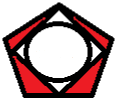
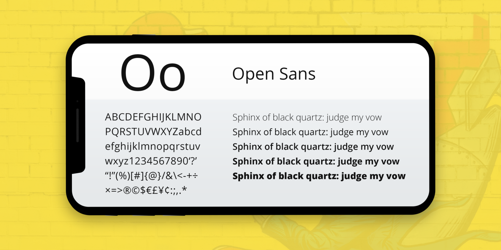

DIU - Practica2, entregables
## Paso 3. Mi equipo UX-Case Study 

 3.a ¿Como se cuenta un UX-Case Study?
-----
Se nos presenta un caso de UX sobre una aplicación para el arte callejero. Esta aplicación parte sobre una base confiable ya que existen numerosos aplicaciones así y por el estudio de mercado se puede entrever que hay usuarios a los que satisfacer con esta aplicación. El desarrollo de esta aplicación comienza con una pregunta, ¿ Y si pudiéramos conocer el nombre del artista callejero?, es una pregunta que nos ha podido surgir alguna vez y con la que comienzan la creación de la aplicación.

En este caso caso UX crean un cliente ficticio y sus objetivos, permitiendo así un mayor acercamiento a lo que sería un caso real. Nosotros en nuestra práctica, no usamos la creación de un cliente ficticio con sus objetivos e inquietudes para marcarnos el camino, sin embargo observamos el gran valor que puede ofrecer utilizar este cliente ficticio. Otra técnica que acerca las necesidades del cliente con los desarrollador es Feature Prioritisation, como una buena forma de satisfacer al cliente y organizar el flujo de trabajo.
Se puede ver esta importancia al mercado, con el análisis competitivo, donde se crea una tabla de las funcionalidades que tienen los competidores pero con ausencia de un análisis de estas funcionalidades y se las realizan de forma correcta.

Uno de los puntos más importante de este análisis, es la forma que han tenido de crear sus usuarios ficticios, han generado una serie de necesidades que pueden tener los futuros clientes (user research) , observan a algunas personas interactuando con el arte callejero (contextual inquiry), crean un empathy map (técnica que no usamos pero bastante útil) y realizan una serie de entrevistas. Con toda esa información, ordenada y reunida, crean dos perfiles de usuarios para su aplicación gracias al affinity mapping. Esta forma de trabajar les permite elaborar unas personas ficticias con gran background e información a la hora de someterlas al análisis de la aplicación, siendo vital para su éxito.

Presentan una gran importancia y tiempo al desarrollo de un diseño funcional y que puedan entender los usuarios, buena prueba de ello son las dos rondas del prototipo donde al producir confusión el diseño, lo cambian para solucionar estos problemas, sin embargo en ningún momento tienen en cuenta discapacidades o si este diseño es funcional para la mayoría de la población o si tiene algún problema de usabilidad más allá de los obvios (primeras rondas de diseño), por tanto nosotros hubiésemos optado por hacer más énfasis a este apartado con distintas técnicas de análisis.
Es importante destacar también la guía de estilo para el sistema y GUI, siendo esta muy útil.

Este artículo es una buena muestra de cómo realizar métodos y técnicas para el UX y cuan importantes son. A lo largo del mismo, se van detallando las distintas técnicas, donde cabe destacar empathy map, contextual inquiry y affinity mapping a la hora de crear los perfiles. Respecto a nuestra práctica, realizamos una labor similar, con la salvedad de que su creación de perfiles quizás tiene más información y background para cada perfil. Es de interés destacar el esfuerzo que se realiza en la parte de diseño y como realizan cambios tras unas primeras interacciones con los usuarios, así como las explicaciones de las ventanas y su uso. En este apartado las similitudes con nuestro trabajo son mayores, así como el uso de bocetos de la aplicación. La mayor diferencia tras analizar este artículo es el enfoque más comercial que tiene Muse Map, creando un cliente ficticio o tomando especial consideración de las necesidades de este cliente.

  3.b Logotipo
----
 Logo

Hemos elegido este logo ya que representa un avión despegando, característicia muy habitual de los viajes largos.
Creemos que este logo tiene carisma y puede desempeñar las funciones de cabecera en nuestra página, además de ser un icono distinguible del resto de aplicaciones con las que compartimos ideales.

 3.c Guidelines
----

Para la investigación de diseño y patrones hemos consultados algunas páginas y hemos podido extraer algunos patrones y técnicas de diseño para nuestra aplicación.

Siguiendo con la guía UX de Google puede ser interesante aplicar:

1.Navegación y exploración de la aplicación:
    - Mostrar el valor de la aplicación en la primera vez
        Es importante mostrar el cliente las opciones de nuestro sistema al usuario nada más entrar, buscar viajero, crear viajes y ver viajes anteriores.
    - Organizar y etiquetar las categorías del menú
        Se realiza una agrupación correcta en las categorías del menú para no confundir al usuario y que se queden bien diferenciadas. Experiencias en nuestro menú podría llevar a confundirse con viajes.
    - Colocar el campo de búsqueda en una posición destacada
        Es vital que los usuarios puedan acceder de forma rápida al campo de búsqueda y que sea visualmente fácil localizarlo, para ello tenemos un cuadro de búsqueda en la parte central justo debajo del logo.
2.Registro:
    - Ofrecer una utilidad clara antes de solicitar el registro
        Una aplicación que impide ver sus funciones antes de registrarse, puede provocar desconfianza en los usuarios. Nuestra aplicación permite su visualización completa sin registro y es arriba a la derecha de la app donde se puede ver la ventana para el registro o el inicio de sesión.

Respecto a ui-patterns :

    - Autocomplete Design Pattern
        Para las búsqueda es útil seguir el diseño de autocompletado, permitiendo a los usuarios realizar las búsquedas más rápidas. Para ello se van mostrando búsquedas o sugerencias para lo que el usuario ha escrito hasta ese momento.
    - Chat Design Pattern
        Es vital que los usuarios puedan chatear sin tener que salirse del sistema. En nuestra aplicación, el chat permite hablar de forma global con todos los usuarios del sistema y también de forma privada e individual con un usuario concreto. Para seguir este patrón es necesario proporcionar una ventana para el chat, una barra para enviar esos mensajes y un ventana que muestre dichos mensajes, será necesario que quede por encima del resto de funciones de la aplicación (para no tener que salir de esta) y mostrar de forma clara esa división entre el chat de todos los usuarios y los privados.

En [SmashingMagazine](https://www.smashingmagazine.com/2010/04/maps-in-modern-web-design/) podemos aplicar estos patrones:

    - Wax Creative Design
        Con este diseño mantenemos la información dada en el apartado “Sobre nosotros”lo más limpio posible. Le damos personalidad a la página con algún detalle de cada uno (por ejemplo su rutina diaria favorita), además de que damos un toque más jovial y amigable a la página.
    - Interactive Maps
        Para realizar el uso de un mapa interactivo a la hora de crear viajes es mejor invitar al usuario en cada de las opciones. Una forma de simplificarlo es eliminando las leyendas convencionales y usar controles básicos para moverse por el.
        falta escribrolo.

    - Explicación menú hamburguesa
        Debido a que queremos hacer que nuestra aplicación sea accesible, hemos pensado que hacer una sola página que contenga toda la información puede ser lo mejor.
        La página principal de nuestra aplicación estará dividida en secciones. 

        Podrás acceder a esas secciones deslizando hacia arriba o hacia abajo en la pantalla o bien usar la herramienta de la hamburguesa, la cual será un botoncito desplegable que cuando le des te muestre las diferentes secciones a las que puedes ir, y si haces click, la propia aplicación te llevará a esa sección. Todo esto sin recargas de página. 

        Esta herramienta si se usa bien garantiza bastante eficiencia y velocidad de manejo, además que su uso es bastante extendido en otras aplicaciones.
    
    - Guia visual de estilo (paleta de colores, fuentes, etc)
  Tipografia     
        - Iconografía
  Icono 1

  Icono 2
  Icono 3
  Icono 4
  Icono 5
  Icono 6
  Icono 7
  Icono 8
  Icono 9
  Icono 10
        - Guia de color
  Guia Color

    
  3.d Video
----

>>> Documente y resuma el diseño de su producto en forma de video de 90 segundos aprox