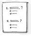

# DIU - Practica 4, entregables
## Paso 4. Evaluación 

 4.a Casos asignados
----

## Caso 1

Para el primer caso, los compañeros han analizado un servicio de compartir viajes junto con una persona que utilice la misma aplicación. Sobre la propuesta de valor, pretenden mejorar el diseño ya existente de la plataforma analizada por ellos, de forma que puedan añadir nuevas mejoras que favorezcan el uso de dicha aplicación.

[Case Study](https://github.com/DavidGmezHdez/DIU20/blob/master/P4/UXCaseStudy-review%20-%20DIU1.COHETE.pdf)
[Repositorio](https://github.com/migue99angel/DIU20)

## Caso 2

Para este caso, el compañero ha analizado una plataforma que permite ofrecer habitaciones como renting para que varias personas puedan quedarse a dormir en tu casa en vez de tener que ir a un hotel, favoreciendo así el turismo. En su propuesta de valor nos relata que su objetivo con el proyecto es el de mejorar las prestaciones que ofrecía el anterior servicio, así como cambiarle el enfoque, de ser sólamente de ocio a que también se pùeda llevar a cabo en el ámbito laboral y estudiantil.

[Case Study](https://github.com/DavidGmezHdez/DIU20/blob/master/P4/UXCaseStudy-review%20-%20DIU2.GMI.pdf)
[Repositorio](https://github.com/GonzaloMartinezIanez/DIU2-GMI)

## Caso 3

Para este caso, el compañero ha analizado una plataforma que permite compartir viajes, eventos, etc. de forma que pueda ser usado por uno o más usuarios. Nuesttro compañero ha pensado en mejorar todos los aspectos relacionados con su plataforma inicial. Esto conlleva a una mejora en la oferta y demanda de los usuarios, que tienen más poder a la hora de establecer los precios. Esto permitirá que haya un equilibrio y mejor personalización en los trayectos de viajes.

[Case Study](https://github.com/DavidGmezHdez/DIU20/blob/master/P4/UXCaseStudy-review%20-%20DIU3.Bolargo.pdf)
[Repositorio](https://github.com/iscoct/DIU20)

 4.b User Testing
----

>>> Seleccione a una de sus personas ficticias. Exprese las ideas de posibles situaciones conflictivas de esa persona en las propuestas evaluadas

	Describe la experiencia 1

	Describe la experiencia 2

	Describe la experiencia 3

. 4.c Ranking 
----

>>> Concluya con un ranking de los casos evaluados 

>>> Valoración personal 
